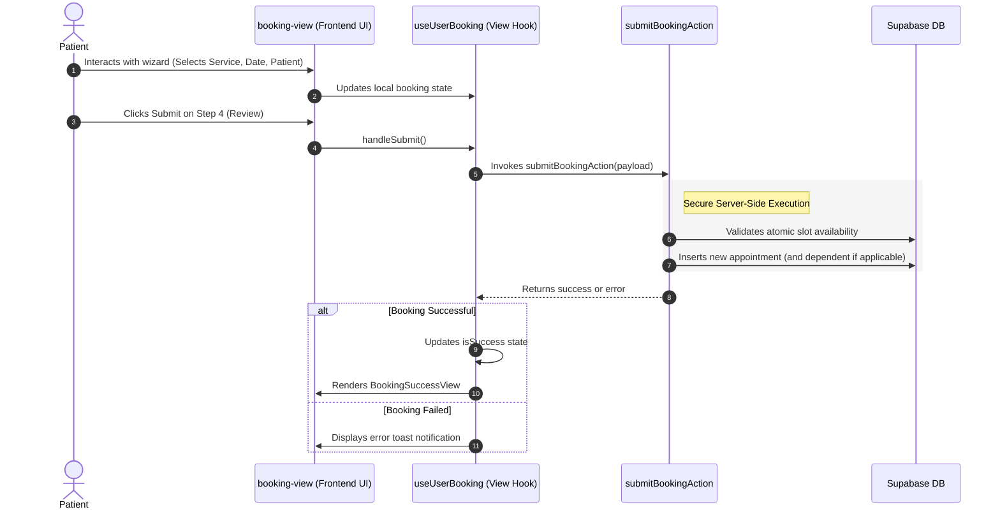

# Patient Booking Flow Feature: High-Level Overview & Flow

This document details the Patient Booking Feature flow, requirements, and system design at a high level. For detailed implementation guides of specific layers, see the [Frontend Guide](frontend.md) and [Backend Guide](backend.md).

---

## 🌟 Feature Overview

The Patient Booking Flow is a guided wizard designed to be a standalone, distraction-free experience for authenticated patients. It allows users to seamlessly schedule appointments for themselves or their dependents.

### Key Capabilities & Rules
1. **Standalone Full-Page Wizard**:
   * The booking wizard runs on its own dedicated page (`/booking`), independent from the standard Patient Portal layout, minimizing distractions.
2. **Smart Redirection & Authentication**:
   * **Signed In (Direct)**: Directs securely to `/booking`.
   * **Signed Out (Redirect)**: Clicking "Book Now" prompts login via `/auth/login?redirect=/booking`. Post-login, it automatically routes users to the wizard.
3. **Multi-Patient Support**:
   * Patients can book appointments for themselves or create new dependent profiles directly within the wizard.
4. **Atomic Submission**:
   * No slots are held during navigation. The final submit step performs a robust atomic check to avoid double-booking.

---

## 🔄 End-to-End Main Architectural Flow

