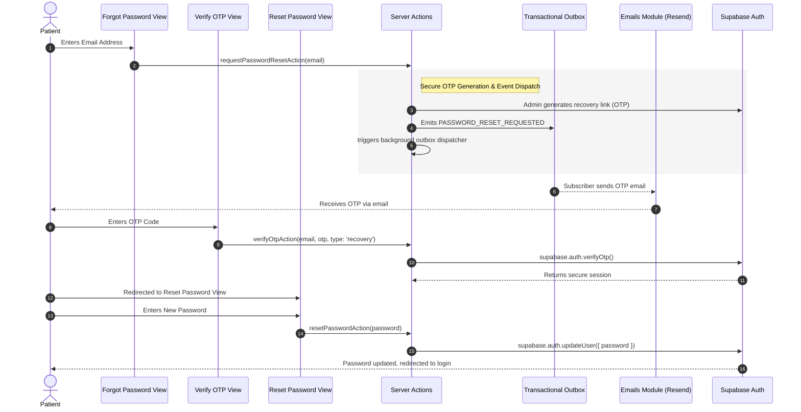

# Patient Forgot Password Feature: High-Level Overview & Flow

This document details the Patient Forgot Password and Recovery flow, requirements, and system design at a high level. For detailed implementation guides of specific layers, see the [Frontend Guide](frontend.md) and [Backend Guide](backend.md).

---

## 🌟 Feature Overview

The Forgot Password flow enables patients to recover access to their accounts autonomously. It mirrors the Event-Driven architecture used during registration to maintain DRY (Don't Repeat Yourself) principles.

### Key Capabilities & Rules
1. **Secure Email Delivery via Outbox**:
   * Recovery emails are not sent directly from the UI or web server. Instead, a `PASSWORD_RESET_REQUESTED` domain event is emitted to the transactional outbox to ensure reliable delivery.
2. **OTP-Based Verification**:
   * Users verify their identity using an 8-digit OTP code sent to their registered email address.
3. **Session Re-establishment**:
   * Successfully verifying the OTP automatically grants a secure, temporary session required to set a new password.
4. **Preventing Email Enumeration**:
   * The system silently succeeds even if the email does not exist, protecting against bad actors attempting to harvest registered email addresses.

---

## 🔄 End-to-End Main Architectural Flow

The recovery flow separates the interactive UI into three distinct pages (`Request`, `Verify OTP`, `Reset Password`) and uses Next.js Server Actions for secure execution.

### Flow Breakdown
1. **Request Page**: Patient enters their email. The server action validates the email, fetches the user's `firstName`, uses Supabase Admin to generate a recovery link, and queues a `PASSWORD_RESET_REQUESTED` event in the Outbox. The background dispatcher then kicks off the Resend API.
2. **Verification Page**: Patient enters the 8-digit code. The server action (`verifyOtpAction`) verifies the code. Crucially, the action asserts state logic: it ensures the `type` is 'recovery', the user is known, and the session matches.
3. **New Password Page**: With the session established by the OTP verification, the patient enters their new password. `resetPasswordAction` securely updates the credentials using `supabase.auth.updateUser()`.
