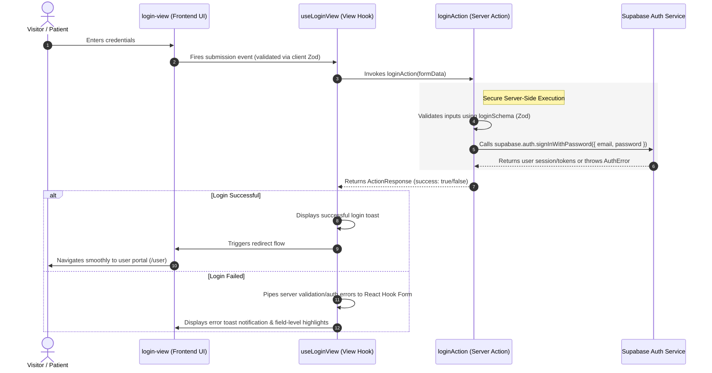

# Patient Log-In Feature: High-Level Overview & Flow

This document details the Patient Log-In (Authentication) feature flow, requirements, and system design at a high level. For detailed implementation guides of specific layers, see the [Frontend Guide](frontend.md) and [Backend Guide](backend.md).

---

## 🌟 Feature Overview

The Patient Log-In flow is the primary gateway for registered patients to access their private accounts, manage appointments, update profiles, and coordinate care. It is designed to be highly secure, responsive, and closely integrated with Supabase Authentication.

### Key Capabilities & Rules
1. **Secure Credential Entry**:
   * Collects mandatory identity fields: Email Address and Password.
2. **Seamless Recovery**:
   * Direct integration with the password recovery ("Forgot Password") flow for seamless self-service support.
3. **Robust Input Validation**:
   * Utilizes client-side Zod schemas for immediate syntax checking (e.g., ensuring a valid email format).
4. **Server-Side Security Verification**:
   * Executes secure password-based authentication against Supabase Auth.
5. **Seamless Redirection**:
   * Transitions the user directly into their designated portal directory (`/user`) upon successful verification.

---

## 🔄 End-to-End Main Architectural Flow

The log-in flow maintains a clean decoupling between the presentational interactive UI (Frontend) and the secure authentication logic (Backend/Server Actions).

### Flow Breakdown
1. **User Action**: The patient completes the login form and clicks "Log In". If they forgot their password, they can trigger the separate Forgot Password flow.
2. **Client Validation**: React Hook Form with a Zod resolver instantly checks for valid formatting. If valid, the submission delegates to `useLoginView`.
3. **Server Action Invocation**: The hook triggers the `loginAction` server action, passing a plain serialized `LoginInput` object.
4. **Server-Side Validation**: The action parses inputs using `loginSchema` and performs a secondary server check to ensure the password exists.
5. **Supabase Authentication**: The server action initializes a secure server-side Supabase client and attempts to sign in via `supabase.auth.signInWithPassword()`. Supabase validates credentials and sets session cookies.
6. **Error/Success Routing**:
   * Under **success**: An action response indicating success is returned, a successful toast triggers, and the Next.js router transitions the client to `/user`.
   * Under **failure**: The action returns an error payload, which the view hook maps back to RHF field errors and triggers a feedback toast.
