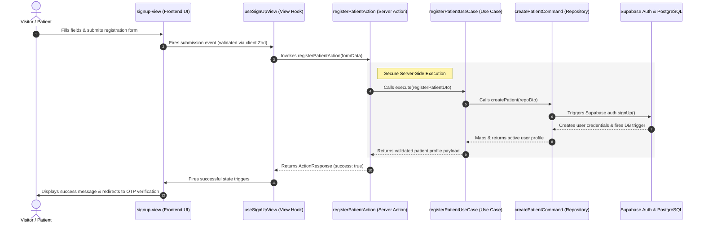

# Patient Sign-Up Feature: High-Level Overview & Flow

This document details the Patient Sign-Up (Registration) feature flow, requirements, and system design at a high level. For detailed implementation guides of specific layers, see the [Frontend Guide](frontend.md) and [Backend Guide](backend.md).

---

## 🌟 Feature Overview

The Patient Sign-Up flow is the primary entry point for new patients onto the Samson Dental online portal. It is designed to be frictionless while ensuring 100% data integrity and security.

### Key Capabilities & Rules
1. **Frictionless Form Collection**:
   * Collects mandatory identity fields: First Name, Last Name, Email, Phone Number, and Date of Birth.
   * Allows optional collection of Middle Name and Suffix.
2. **Strict Consent Policy**:
   * Enforces explicit acceptance of Terms of Service & Privacy Policy via a required client-side toggle validation.
3. **Password Safeguards**:
   * Double-entry password confirmation to prevent typing mistakes.
4. **Instant Security Bridge**:
   * Bridges registration directly to Supabase Auth OTP verification.

---

## 🔄 End-to-End Main Architectural Flow

The sign-up flow maintains a clean decoupling between the presentational interactive UI (Frontend) and the secure database transaction boundaries (Backend).

### Flow Breakdown
1. **User Action**: The visitor completes the registration fields on the dumb form component and clicks "Sign Up".
2. **Client Validation**: Zod instantly reviews field formatting in the browser. If valid, the submission is delegated to the view hook.
3. **Action Delegation**: The view hook invokes the Next.js Server Action (`registerPatientAction`), passing a plain serializable data transfer object.
4. **Security & Identity Execution**: The Server Action creates a secure client instance, runs the backend Zod validation schema, and calls the use-case.
5. **Database Transaction**: The repository invokes `supabase.auth.signUp()`. A PostgreSQL database trigger automatically translates auth credentials into a structured profile row in the `users` table.
6. **Confirmation & OTP**: The client receives a success status, alerts the patient via a toast, and routes them to the verification screen.
