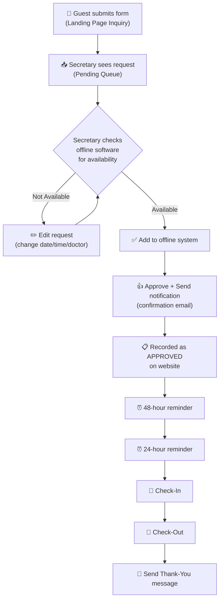
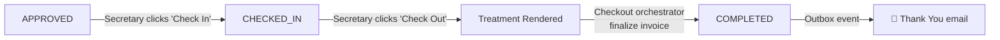
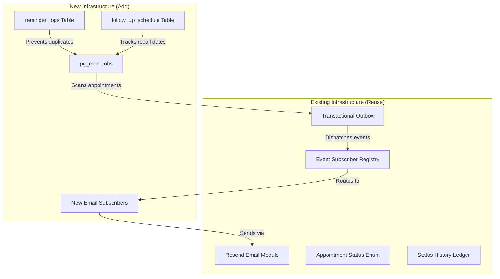

# Samson Dental — System Analysis & Improvement Recommendations

## Your Current Flow (As I Understand It)



> [!NOTE]
> Your system is essentially an **Appointment Hub** — a bridge between the offline scheduling software and the patient-facing digital experience. It automates the communication layer (confirmations, reminders, thank-yous) while the secretary remains the decision-maker.

---

## What You Already Have Built ✅

| Component | Status | Key Files |
|:---|:---|:---|
| Guest inquiry form | ✅ Done | `appointment_inquiries` table |
| Secretary pending queue with edit | ✅ Done | [SecretaryPendingRequestsView](file:///c:/Users/picar/Desktop/samson-website/samson-nextjs/src/modules/appointments/views) |
| Manual booking (walk-in/phone) | ✅ Done | `create_manual_booking` RPC |
| Inquiry → Appointment conversion | ✅ Done | `convert_inquiry_to_appointment` RPC |
| Approval status transitions | ✅ Done | Status history ledger |
| Transactional outbox events | ✅ Done | [outbox](file:///c:/Users/picar/Desktop/samson-website/samson-nextjs/src/shared/outbox) |
| Email subscribers (booking, conversion) | ✅ Done | [email subscribers](file:///c:/Users/picar/Desktop/samson-website/samson-nextjs/src/modules/emails/subscribers) |
| Checkout orchestrator | ✅ Done | [checkout.orchestrator.ts](file:///c:/Users/picar/Desktop/samson-website/samson-nextjs/src/orchestrators/checkout.orchestrator.ts) |

## What's Missing or Incomplete 🔲

| Feature | Status | Notes |
|:---|:---|:---|
| 24/48-hour reminders | 🔲 Not built | No scheduler/cron infrastructure |
| Check-in flow | 🔲 Partially | `CHECKED_IN` status exists but no dedicated UI flow |
| Check-out → Thank You email | 🔲 Partially | Checkout orchestrator exists but no thank-you email trigger |
| Post-visit follow-up (1 month) | 🔲 Not built | Client's request for re-engagement |
| Status lock enforcement | 🔲 Pending | Item #96-97 in [toTO.md](file:///c:/Users/picar/Desktop/samson-website/.CORE_DOCUMENTATION/SERVERLESS_ARCHI/1.5.-BUSSINESS-PLAN/toTO.md) |

---

## 🚀 Recommended Improvements

### 1. Automated Reminder System (24h & 48h)

> [!IMPORTANT]
> This is your **highest-value automation** — it eliminates the secretary's most redundant daily task.

**Architecture: Supabase `pg_cron` + Edge Function**

Since you're serverless on Supabase, the cleanest approach:

```
┌────────────────────────────────────────────────────────────┐
│  pg_cron runs every 30 minutes                             │
│  → Queries: appointments WHERE status = 'APPROVED'         │
│    AND date - NOW() BETWEEN 23h and 25h (24h window)       │
│    AND NOT EXISTS reminder_log for this appointment+type   │
│  → Inserts matching rows into `outbox` table               │
│    with event_type = 'REMINDER_24H'                        │
│  → Same logic for 47h-49h → 'REMINDER_48H'                │
└────────────────────────────────────────────────────────────┘
         │
         ▼
┌────────────────────────────────────────────────────────────┐
│  Existing outbox dispatcher picks up events                │
│  → Email subscriber sends reminder email via Resend        │
│  → (Future) SMS subscriber sends SMS reminder              │
└────────────────────────────────────────────────────────────┘
```

**New DB objects needed:**
- `reminder_logs` table — tracks which reminders were sent (prevents duplicates)
- `pg_cron` job — runs the scan every 30 minutes
- New outbox event types: `REMINDER_24H`, `REMINDER_48H`
- New email subscribers: `on-reminder-24h.subscriber.ts`, `on-reminder-48h.subscriber.ts`

**Why this approach:**
- Zero new infrastructure — reuses your existing outbox + email pipeline
- Idempotent — `reminder_logs` prevents double-sends
- Serverless-friendly — no always-on server needed

---

### 2. Check-In → Check-Out Flow Enhancement

Your `appointment_status` enum already has `CHECKED_IN` and `COMPLETED`. Here's the recommended flow:



**What to build:**
- **Check-In action**: Simple status transition `APPROVED` → `CHECKED_IN` with timestamp
- **Secretary Today View**: A dashboard filtered to today's `APPROVED` appointments, showing a "Check In" button for patients who arrive
- **Post-checkout trigger**: Wire `APPOINTMENT_COMPLETED` outbox event → thank-you email subscriber

---

### 3. Post-Visit Follow-Up System (1 Month Auto-Recall)

> [!TIP]
> This is what your client means by "after 1 month have auto or something" — it's called a **Patient Recall System** in dental practice.

**Two tiers of implementation:**

#### Tier A: Automated Follow-Up Email (Simple — Recommended First)
- When an appointment reaches `COMPLETED`, calculate `completed_date + 30 days`
- Store this in a `follow_up_schedule` table
- `pg_cron` scans daily for follow-ups due today → emits `FOLLOW_UP_DUE` outbox event
- Email subscriber sends: *"Hi [Name], it's been a month since your last visit at Samson Dental. Would you like to schedule your next check-up?"*
- Include a **one-click booking link** back to the guest form (pre-filled with their info)

#### Tier B: Smart Recall with Configurable Intervals (Future)
- Let the secretary/admin configure recall intervals per service type:
  - Cleaning → 6 months
  - Root Canal follow-up → 2 weeks
  - General checkup → 1 year
- `recall_rules` table: `service_id`, `recall_interval_days`, `message_template`
- System checks `completed appointments + recall_interval` and sends tailored messages

---

### 4. Secretary "Today Dashboard" (Operational Command Center)

Instead of the secretary juggling between the pending queue and checking offline software, give them a **single daily view**:

```
┌─────────────────────────────────────────────────────────┐
│  📅 Today: January 5, 2027                              │
├─────────────────────────────────────────────────────────┤
│                                                         │
│  🟡 UPCOMING (3)         🟢 CHECKED IN (1)              │
│  ┌──────────────────┐    ┌──────────────────┐           │
│  │ 9:00 AM          │    │ 8:30 AM          │           │
│  │ Juan Dela Cruz   │    │ Maria Santos     │           │
│  │ Cleaning         │    │ Root Canal       │           │
│  │ Dr. Samson       │    │ Dr. Samson       │           │
│  │ [Check In]       │    │ [Start Checkout] │           │
│  └──────────────────┘    └──────────────────┘           │
│                                                         │
│  🔴 NO-SHOW (0)          ✅ COMPLETED (2)               │
│                          (collapsed - click to expand)  │
│                                                         │
│  ⚠️ TOMORROW'S SCHEDULE (5 appointments)                │
│  (preview, reminders already sent ✓)                    │
└─────────────────────────────────────────────────────────┘
```

**Value:** This eliminates tab-switching and gives the secretary a real-time operational view.

---

### 5. No-Show Auto-Detection

If a patient doesn't check in within X minutes after their appointment `start_time`:
- Auto-flag as `NO_SHOW` (configurable delay, e.g., 30 minutes)
- Increment `no_show_count` on the user record
- Optionally send a "We missed you" message with reschedule link
- This is another `pg_cron` job scanning for stale `APPROVED` appointments past their time

---

### 6. SMS Channel (Future, High Impact)

> [!IMPORTANT]
> Email open rates for dental reminders: ~20%. SMS open rates: ~98%. For the Filipino market, SMS/Viber is far more effective than email.

Your outbox architecture already supports this beautifully — just add new subscribers:
- `on-reminder-24h-sms.subscriber.ts`
- `on-follow-up-sms.subscriber.ts`

**Recommended providers for PH:** Semaphore, Engagespark, or Globe Labs API.

---

## Priority Roadmap

| Priority | Feature | Effort | Impact |
|:---:|:---|:---:|:---:|
| 🥇 | 24h/48h Reminder System (`pg_cron` + outbox) | Medium | 🔥🔥🔥 |
| 🥈 | Check-In/Out Flow + Thank You Email | Small | 🔥🔥🔥 |
| 🥉 | Secretary Today Dashboard | Medium | 🔥🔥 |
| 4 | 1-Month Follow-Up / Recall System (Tier A) | Medium | 🔥🔥 |
| 5 | No-Show Auto-Detection | Small | 🔥 |
| 6 | Smart Recall with configurable intervals (Tier B) | Large | 🔥🔥 |
| 7 | SMS Channel (Semaphore/Viber) | Medium | 🔥🔥🔥 |

---

## Architectural Fit

All of these features fit your **existing architecture** perfectly:



> [!TIP]
> The beauty of your outbox pattern is that **every new automation is just a new subscriber + a new cron trigger**. No architectural changes needed.

---

## Open Questions for You

1. **Reminder timing**: Is 24h + 48h correct, or do you want different intervals (e.g., 72h + 24h)?
2. **Follow-up interval**: Is 1 month the standard, or should it vary by service?
3. **SMS budget**: Is SMS/Viber integration something the client would pay for, or email-only for now?
4. **No-show threshold**: How many minutes past the appointment time before marking no-show?
5. **Which feature do you want to build first?**
