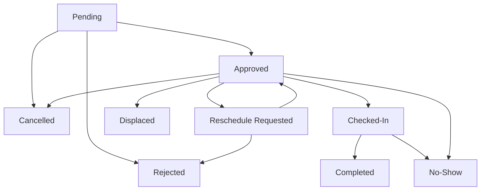

# Booking — Appointment Statuses, Notes, Actions & Rules

## Appointment Status Constants

| Status | Description |
|---|---|
| **Pending** | Submitted request, awaiting staff review. Slot is disabled/unclickable for other users. |
| **Approved** | Confirmed by clinic with an approval reason; synchronized to doctor calendar. |

| **Rejected** | Declined by staff with a rejection reason (can issue warnings to user). |
| **Cancelled** | An approved or pending appointment was cancelled by user or secretary; requires a reason. Recorded for credibility. 

| **Reschedule Requested** | An approved appointment where the user has requested a single allowed reschedule. Must be re-approved by secretary. |
| **Displaced** | Slot is no longer valid due to a system or secretary action (blocked date, time, removed service, doctor unavailability). |

| **Checked-In** | Patient has arrived at the clinic for their appointment. |
| **Completed** | Patient attended and checked out; system unlocks invoicing and dental history updates. |
| **No-Show** | Patient failed to attend without cancelling. Recorded for credibility. |

---

<!-- button
checkin => checked in 
<!-- invoice => consultation
complete => -->
<!-- consultation cleaning
complete => form => sumbuit completed
completed => view  --> -->

## Appointment Status Flow

---

## Request Notes & Reasons

Every appointment stores notes and reasons for traceability:

| Action | Note / Reason |
|---|---|
| Booking submission | User note describing their specific needs (entered during wizard) |
| Approve | Staff selects a predefined reason or enters a custom approval reason |
| Reject | Staff selects a predefined reason or enters a custom rejection reason |
| Cancel | Reason is **required** regardless of who cancels (user or secretary) |
| Reschedule Request | User provides reason for requesting the reschedule |
| Displace | System records the displacement cause (blocked date, blocked time, removed service, doctor unavailable). Prompts secretary with a force displace warning if they initiate the action. |

---

## Action Rules

### What can happen to each status

| Status | Allowed Actions |
|---|---|
| **Pending** | Approve, Reject, Cancel |
| **Approved** | Reschedule Request (User), Reschedule (Secretary), Cancel, Displace, Check-In, Mark No-Show |
| **Rejected** | No further actions |
| **Cancelled** | Slot is freed back to availability pool |
| **Reschedule Requested** | Approve, Reject |
| **Displaced** | User is forced back to availability selection if a new slot is available |
| **Checked-In** | Complete | 
| **Completed** | Invoicing and dental history are unlocked |
| **No-Show** | No further actions. Recorded as negative credibility. |

### User-Specific Rules

- Users may cancel **pending** requests at any time (prompts for reason, records credibility).
- Users may cancel **approved** appointments (prompts for reason, warns of excessive cancellations, records credibility).
- Users **cannot directly reschedule**. They can only submit a **Reschedule Request** on an approved appointment.
- Users are allowed only **ONE** Reschedule Request per appointment.
- If a Reschedule Request is submitted, the appointment re-enters the approval queue for the secretary.

### Staff Rules

- Secretaries and admins can reschedule freely on behalf of users.
- Secretaries process Reschedule Requests (approve or reject).
- Secretaries manage Attendance (mark as Checked-In when patient arrives, Completed when they leave, or No-Show if they miss it).
- All secretary actions (approve, reject, cancel, reschedule, check-in, complete, no-show) require a **confirmation popup** with reason selection before execution.

---

## Q&A — Common Edge Cases

**Q: What if a Pending request is not reviewed in time?**  
A: The system auto-cancels the request with reason "Expired (No response)" and returns the slot to availability.

**Q: Does a Reschedule Request reserve the new slot?**  
A: No. The requested time is only a preference. Approval revalidates availability at decision time; if the slot is no longer free, the request is rejected with a reason.

**Q: Can No-Show be applied automatically?**  
A: Yes, a clinic-configurable end-of-day job can mark unprocessed Approved appointments as No-Show.

---

## Reliability Tracking & Credibility

User reliability is strictly tracked with counters per account to prevent abuse and inform secretary decisions:

| Counter | Tracks | Consequence |
|---|---|---|
| `cancelCount` | Number of cancellations initiated by the user (pending or approved) | Warnings given; can lead to booking restrictions |
| `noShowCount` | Number of no-shows recorded | High negative credibility; immediate warnings |
| `rescheduleCount` | Number of reschedule requests | Tracked to monitor booking stability |

These counters are visible to secretaries on the approval page to help assess booking reliability before approving or rejecting new requests.

---

---

## Invoicing

| Trigger | Behavior |
|---|---|
| Automatic | When appointment time passes, an invoice is generated as a **draft** |
| Manual | Secretary/Admin clicks "Completed" (checkout) — generates/finalizes the invoice |
| Draft invoices | Have a "Checkout" button so additional services can be added before finalization |
| Purpose | Strictly formal digital record-keeping; **no online payment gateway** |

---

## Doctor Calendar Conflicts & Double-Booking Prevention

- Because slot holds have been removed for speed, conflict validation happens strictly at the **final submission step**.
- If two users submit for the same slot simultaneously, the database enforces a unique constraint on `(doctor_id, date, time_slot)`.
- The first request succeeds and enters the **Pending** state. The second request fails, and the user is prompted to select a new time.
