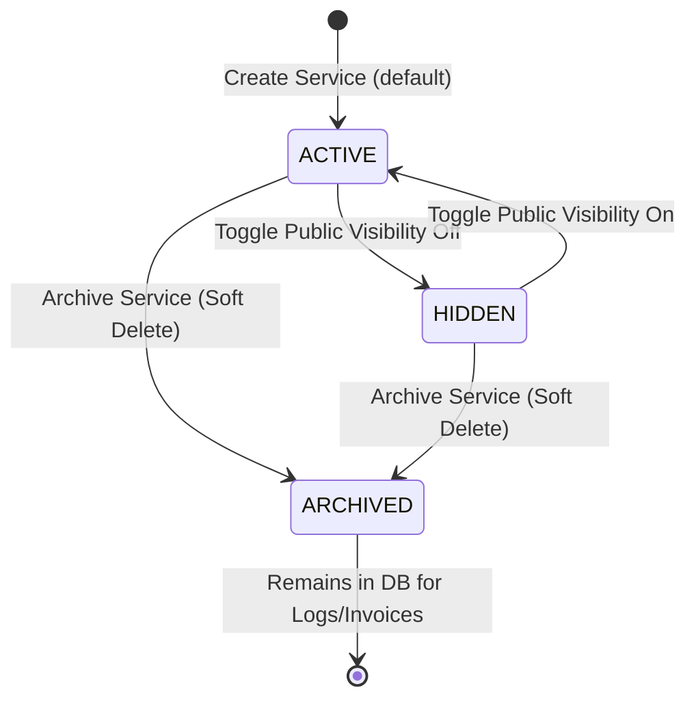

# Secretary Portal: Services Management

**Route**: `/secretary/services`

This page allows the secretary or admin to manage the clinic's treatment catalog using a 2-column split-pane layout.

---

## 1. Service Lifecycle

Services are never hard-deleted from the database to preserve historical invoices, past bookings, and financial analytics. They follow a simplified 3-state lifecycle:



> **Note:** New services are set to `ACTIVE` immediately on creation. There is no draft/approval step.

### Lifecycle States Reference:

| State | Patient Portal (Self-Book) | Secretary Portal (Intake Wizard) | Historical Records & Logs | Description / Use Case |
| :--- | :---: | :---: | :---: | :--- |
| **ACTIVE** | ✅ | ✅ | ✅ | Standard treatments available clinic-wide for self-booking and walk-ins. |
| **HIDDEN** | ❌ | ✅ | ✅ | Specialized, high-risk, or custom treatments (e.g., Oral Surgery) that require clinic staff screening before booking. |
| **ARCHIVED** | ❌ | ❌ | ✅ | Retired treatments. Past receipts and invoice listings remain entirely intact. |

---

## 2. Split-Pane Layout & User Interface Details

The Services page utilizes a **2-column split-pane layout** (`lg:grid-cols-12` where the left list is `lg:col-span-5` and the right details pane is `lg:col-span-7`).

### Left Column (Service Roster / Cards)
- Scrollable list of service items.
- **Header**: Contains a search bar (by service name), two filter dropdowns, and a primary **"+ Add Service"** button.
  - **Status Filter**: `All` | `ACTIVE` | `HIDDEN` | `ARCHIVED`. Default: `ACTIVE`.
  - **Tag Filter**: `All` | `General` | `Specialized`. Default: `All`.
  - Both filters are **independent** — they stack. Example: Status=`ACTIVE` + Tag=`Specialized` returns only active specialized services.
- **Service Cards**: Each card displays:
  - **Service Image**: Thumbnail stored in and retrieved from **Supabase Storage**.
  - **Service Title** (e.g., "Composite Filling")
  - **Base Price** (e.g., "₱1,200")
  - **Duration** (e.g., "45 mins")
  - Tag badge (`General` or `Specialized`).
  - Status badge (`ACTIVE`, `HIDDEN`, `ARCHIVED`).
- **Empty State**: If no services exist yet, display a centered illustration with the message *"No services added yet. Click '+ Add Service' to get started."*

### Right Column (Service Details Pane)
- Renders dynamically when a service card is clicked. If no card is selected, displays a default empty selection state.
- **Top Actions Header**:
  - **"Online Booking" Toggle Switch**: Toggles status between `ACTIVE` and `HIDDEN`.
  - **"Archive" Button**: Retires the service, prompting a confirmation warning modal:
    > **Archive Service?**
    > *This will remove this service from all active booking workflows. Historical invoices and records will remain completely unaffected.*
  - **"Edit" Button**: Switches the right pane into an inline editable form layout (no modal).
- **Main Detail Panel**:
  - Displays the large service image banner.
  - Displays the full description, tag (`General` / `Specialized`), base price, and average service time duration.

### Add / Edit Service Form (Inline in Right Pane)
- Input fields:
  - **Service Name** (Text input)
  - **Description** (Textarea)
  - **Tag** (Radio or Toggle: `General` | `Specialized`)
  - **Base Price** (Number input, in PHP ₱)
  - **Duration** (Select: 15m, 30m, 45m, 1h, 1.5h, 2h)
  - **Image Upload Dropzone**: Supports drag-and-drop file uploads.
    - Accepted formats: `JPG`, `PNG`, `WebP`
    - Max file size: `2MB`
    - Image stored in `services-images` **Supabase Storage Bucket**, returning a public URL saved to the database.
- **Action Buttons**: `Save Changes` and `Cancel`.
- On **Save**: service is immediately created/updated with status `ACTIVE`.

---

## 3. Permissions

| Action | Secretary | Admin |
| :--- | :---: | :---: |
| View all services | ✅ | ✅ |
| Add new service | ✅ | ✅ |
| Edit service details | ✅ | ✅ |
| Toggle ACTIVE / HIDDEN | ✅ | ✅ |
| Archive service | ✅ | ✅ |

> Both secretary and admin have full access to service management. No approval workflow required.

---

## 4. Data Schema & TS Interfaces

```typescript
export type ServiceStatus = 'ACTIVE' | 'HIDDEN' | 'ARCHIVED';
export type ServiceTag = 'GENERAL' | 'SPECIALIZED';

export interface Service {
  id: string;
  name: string;
  description: string;
  tag: ServiceTag;            // 'GENERAL' | 'SPECIALIZED'
  base_price: number;         // in PHP
  duration_minutes: number;
  image_url?: string;         // Supabase Storage public URL
  status: ServiceStatus;
  display_order?: number;     // optional manual sort on patient portal
  created_by: string;         // user ID of creator
  updated_by?: string;        // user ID of last editor
  created_at: string;         // ISO timestamp
  updated_at: string;         // ISO timestamp
}
```

> All fields use `snake_case` to match Supabase/PostgreSQL column naming convention.

---

## 5. Appointment Decoupling Rule

**Service status changes never affect existing appointments.**

| Scenario | Existing Appointments | New Self-Bookings (Patient Portal) | New Manual Bookings (Secretary) |
| :--- | :---: | :---: | :---: |
| Service set to `HIDDEN` | ✅ Unaffected | ❌ Blocked | ✅ Still allowed |
| Service set to `ARCHIVED` | ✅ Unaffected | ❌ Blocked | ❌ Blocked |

### Why

When an appointment is created, it stores its own snapshot of the service data at the time of booking:
- Service name
- Price paid
- Duration

The appointment holds a **foreign key reference** to the service record (`service_id`), but it is never invalidated by a status change. Archiving "Cleaning" does not cancel, alter, or hide any past or upcoming appointments that reference it. Those appointments remain fully visible and intact in all records, invoices, and history views.

> **Rule for devs:** When querying appointments, **never filter by `service.status`**. Always join on `service_id` directly. Status is only a gate for new booking creation, not for reading historical data.
