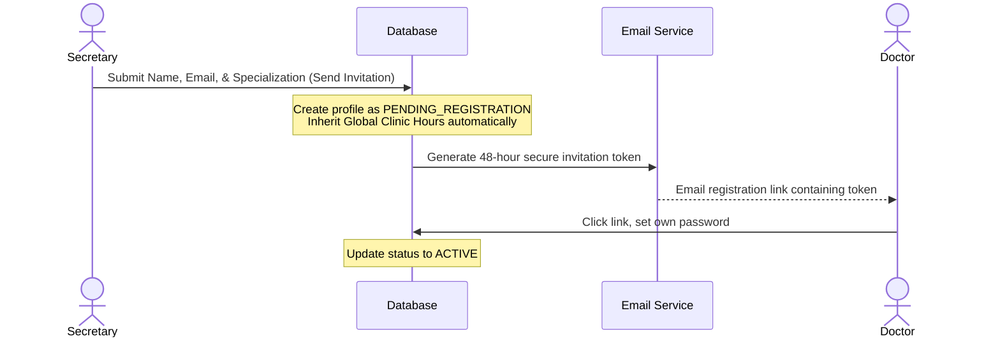

# Secretary Portal: Doctor Management

**Route**: `/secretary/doctors`

This page allows the secretary to view the roster of clinic dentists, manage their active statuses, inspect professional details, and securely invite new doctors to the platform.

---

## 1. The Secure Doctor Invitation Workflow

To avoid insecure password handoffs, the portal enforces an email-driven registration flow:



### Step 1: Intake & Automated Setup (Secretary Side)
1. The secretary opens the **Invite Doctor** form and inputs:
   - **First Name**, **Middle Name**, **Last Name**, **Suffix**
   - **Email Address** (Unique; used for registration link)
   - **Phone Number**
   - **Dental Specialization** (e.g., General Dentistry, Orthodontics, Endodontics, Pediatrics)
2. Clicking **"Send Invitation"**:
   - Creates a new record in the database with status set to `PENDING_REGISTRATION`.
   - **Schedule Initialization**: The doctor automatically inherits the clinic's Layer 1 Global Baseline Hours as their default Layer 2 shifts on creation, making them instantly bookable during clinic hours without requiring manual setup.

### Step 2: Secure Link Generation & Token Delivery
1. The system creates a secure, single-use registration token linked to the doctor's email (following the same flow as a standard patient/user sign-up workflow).
2. The token is assigned an expiration window (default: **48 hours**).
3. The system dispatches an automated invitation email containing the unique registration link.
4. Once the doctor clicks the link and creates their password, their status transitions to `ACTIVE`.

---

## 2. Split-Pane Layout & User Interface Details

The Doctor Management page utilizes a **2-column split-pane layout** (`lg:grid-cols-12` where the left list is `lg:col-span-5` and the right details pane is `lg:col-span-7`).

### Left Column (Doctor Roster)
- Scrollable list of doctors.
- **Header**: Contains a search bar, status filter dropdown (`ACTIVE`, `PENDING_REGISTRATION`, `INACTIVE`), and an **"+ Invite Doctor"** button.
- **Doctor Cards**: Each card displays:
  - Initials badge or profile image thumbnail.
  - Full Name & Specialization title.
  - Status badge (e.g., Green for `ACTIVE`, Orange for `PENDING_REGISTRATION`, Slate for `INACTIVE`).
  - Contact email.

### Right Column (Doctor Details & Schedule Pane)
- Renders dynamically when a doctor card is clicked.
- **Top Actions Header**:
  - **"Resend Invitation"**: Visible only if status is `PENDING_REGISTRATION`.
  - **Status Selector Dropdown**: Allows toggling between `ACTIVE` and `INACTIVE`.
  - **"Edit Profile"**: Switches fields to edit mode.
- **Main Detail Panel**:
  - **Contact Card**: Full name, email, phone, and specialization.
  - **Current Schedule Summary**: Displays a clean, read-only preview of the doctor's weekly shift routine (e.g., "Monday: 8:00 AM - 5:00 PM", "Sunday: Closed"). Includes a quick link button: **"Edit Doctor Schedule"** which redirects to `/secretary/schedules` with the doctor pre-selected.

---

## 3. Data Schema & TS Interfaces

```typescript
export type DoctorStatus = 'ACTIVE' | 'PENDING_REGISTRATION' | 'INACTIVE';

export interface Doctor {
  id: string;
  firstName: string;
  middleName?: string;
  lastName: string;
  suffix?: string;
  email: string;
  phoneNumber: string;
  specialization: string;
  status: DoctorStatus;
  invitationSentAt: string;
  invitationExpiresAt: string;
  created_at: string;
}
```
