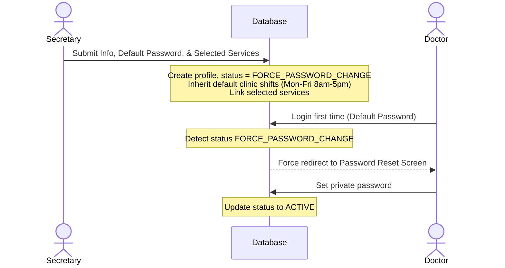

# Secretary Portal: Doctor Management

**Route**: `/secretary/doctors`

This page allows the secretary to view the roster of clinic dentists, manage their active statuses, inspect professional details, associate treatment services they offer, and create new doctor accounts.

---

## 1. Default Password & Force Password Change Workflow

To avoid email delivery failures and simplify onboarding, the portal utilizes a default password creation workflow with enforced password reset on first login:



### Step 1: Intake & Account Creation (Secretary Side)
1. Secretary opens the **Add Doctor** form and inputs:
   - **First Name**, **Middle Name**, **Last Name**, **Suffix**
   - **Email Address** (Unique)
   - **Phone Number**
   - **Dental Specialization**
   - **Default Password** (Pre-filled or customized by secretary, e.g., `Welcome@Samson2026`)
   - **Services Offered**: Selected via interactive UI pills. Secretary can click pills to add or remove services from the doctor's roster.
2. Clicking **"Create Doctor Account"**:
   - Creates the authentication user and profile in `users` with status set to `FORCE_PASSWORD_CHANGE`.
   - **Services Mapping**: Populates the `doctor_services` junction table with selected services.
   - **Schedule Initialization**: Doctor inherits the default clinic schedules: **Monday to Friday, 8:00 AM - 5:00 PM**.

### Step 2: First Login & Forced Reset
1. Doctor logs in using email and default password.
2. Authentication check identifies status `FORCE_PASSWORD_CHANGE`:
   - Session is restricted. Access to dashboard or other routes is blocked.
   - Doctor is forced onto a secure password change form.
3. Once doctor submits a new, secure password, status transitions to `ACTIVE`, enabling full portal access.

---

## 2. Split-Pane Layout & User Interface Details

The Doctor Management page utilizes a **2-column split-pane layout** (`lg:grid-cols-12` where left list is `lg:col-span-5` and right pane is `lg:col-span-7`).

### Left Column (Doctor Roster)
- Scrollable list of doctors.
- **Header**: Contains search bar, status filter dropdown (`ACTIVE`, `FORCE_PASSWORD_CHANGE`, `INACTIVE`), and **"+ Add Doctor"** button.
- **Doctor Cards**: Displays:
  - Profile thumbnail.
  - Full Name & Specialization.
  - Status badge (Green: `ACTIVE`, Orange: `FORCE_PASSWORD_CHANGE`, Slate: `INACTIVE`).
  - Contact email.

### Right Column (Doctor Details & Schedule Pane)
- Renders dynamically when a card is clicked.
- **Layout**: Split into two sub-panes:
  - **Left Sub-Pane (Details)**: Shows read-only contact information and weekly schedules.
  - **Right Sub-Pane (Edit Details & Services)**: Contains the editable form for initial details and the interactive services offered selector.
- **Top Actions Header**:
  - **Status Selector Dropdown**: Toggle between `ACTIVE` and `INACTIVE`.
  - **"Edit Profile"**: Switches the view so that the Right Sub-Pane fields and services selector become interactive.
- **Left Sub-Pane (Details & Schedule)**:
  - **Contact Card**: Full name, email, phone, specialization.
  - **Current Schedule Summary**: Read-only preview of shifts (defaulting initially to Monday to Friday, 8:00 AM - 5:00 PM). Quick link button: **"Edit Doctor Schedule"** (redirects to `/secretary/schedules`).
- **Right Sub-Pane (Edit Details & Services)**:
  - **Form Fields**: Editable input fields for updating initial details (name, phone, specialization).
  - **Services Offered**: Renders as visual pills. In edit mode, these pills have active close/remove controls (`x`), and an "Add Service" dropdown allows clicking new service pills to add them.

---

## 3. Data Schema & TS Interfaces

```typescript
export type DoctorStatus = 'ACTIVE' | 'FORCE_PASSWORD_CHANGE' | 'INACTIVE';

export interface Doctor {
  id: string;
  firstName: string;
  middleName?: string;
  lastName: string;
  suffix?: string;
  email: string;
  phoneNumber: string;
  specialization: string;
  status: DoctorStatus;
  services: string[]; // Array of Service IDs
  created_at: string;
}
```
