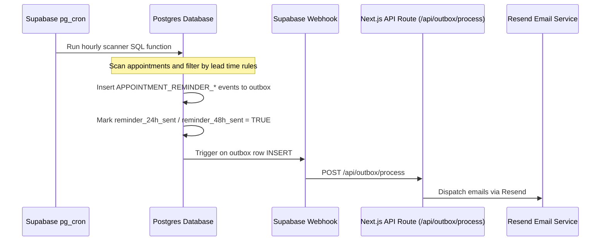

# Serverless Appointment Reminder System

This document specifies the technical design, idempotency logic, and feature roadmap for the automated 24/48-hour appointment reminders.

---

## 1. System Architecture

The reminder pipeline runs completely serverless using **Supabase `pg_cron`** and **Supabase Database Webhooks** integrated with the Next.js outbox event dispatcher:

---

## 2. Lead Time Logic (Preventing Over-messaging)

To prevent spamming patients who book near their appointment dates, the system enforces strict booking window rules:

| Time until Appointment at Booking | Action Taken |
| :--- | :--- |
| **< 24 Hours** | **No reminders sent.** (Patient already got immediate confirmation). |
| **Between 24 and 48 Hours** | **Only send 24-Hour Reminder.** 48-hour reminder is skipped. |
| **> 48 Hours** | **Send both 48-Hour and 24-Hour Reminders.** |

### SQL Implementation Rules:
* When an appointment is booked within 24 hours, the database initialization query automatically flags `reminder_48h_sent = TRUE` and `reminder_24h_sent = TRUE`.
* When booked between 24 and 48 hours, the system sets `reminder_48h_sent = TRUE` and `reminder_24h_sent = FALSE`.

---

## 3. Idempotency & Error Prevention

Double-sending reminders ruins user experience. We prevent this using database-level constraints and status locks:

### A. Strict State Flags (First Line of Defense)
* The `appointments` table maintains two boolean flags: `reminder_24h_sent` and `reminder_48h_sent`.
* **Atomic Execution:** The SQL query that selects pending appointments for reminders **must** perform the `INSERT INTO outbox` and the `UPDATE appointments SET reminder_XXh_sent = TRUE` inside the same database transaction.

### B. Handling Reschedules & Cancellations
* **Cancellation:** If an appointment status changes to `'CANCELLED'`, the SQL cron excludes it since it only queries where `status = 'CONFIRMED'`.
* **Rescheduling:** When an appointment date/time changes:
  * If the new time is **> 48 hours** away: Reset `reminder_24h_sent = FALSE` and `reminder_48h_sent = FALSE`.
  * If the new time is **between 24–48 hours**: Reset `reminder_24h_sent = FALSE` and set `reminder_48h_sent = TRUE`.
  * If the new time is **< 24 hours**: Set both to `TRUE`.

---

* **Resend API Failures & Retries:** 
  * The outbox table tracks `status` and `retry_count`. If Resend throws a rate limit error or fails, the handler catches the error, increments `retry_count`, and resets the status to `PENDING` (re-queue).
  * **How Retries are Triggered:**
    * *Passive Trigger:* Any new outbox insert triggers the webhook (or Next.js after-request handler), which processes all pending items in the queue. This is triggered by **both** guest/patient actions (e.g., submitting inquiries on the landing page) and secretary actions (e.g., manual booking, rescheduling, or confirming requests).
    * *Active Sweep Cron:* A secondary lightweight database cron job runs every 15 minutes to call the `/api/outbox/process` API endpoint directly, acting as a sweeper for failed/stuck `PENDING` events so they retry without relying on website traffic.

### C. Recommended 3-Tier Production Setup
For maximum reliability, we recommend employing all three triggers together:
1. **Passive Trigger (Primary Delivery):** Ensures immediate delivery of confirmations and reschedules as soon as the user acts.
2. **Active Sweep Cron (Automatic Recovery):** Runs every 15 minutes to clean up and automatically retry failed emails due to temporary API rate limits or network hiccups without human intervention.
3. **Dashboard "Resend" Button (Manual Fail-safe):** Gives clinic staff a manual override to force-send a notification directly to a patient if they complain they haven't received it.

---

## 5. Future Feature: Notification & Reminder Hub

To give secretaries full visibility over what patients receive, we will implement a **Reminder Dashboard View** under the Secretary portal:

### Core Capabilities:
1. **Roster Status Board:** List all active appointments with visual status indicators:
   * ✉️ **48H Reminder:** [Sent / Pending / Skipped]
   * ✉️ **24H Reminder:** [Sent / Pending / Skipped]
2. **Audit History Log:** Clicking on an appointment shows a timeline of dispatched events (e.g. "SMS dispatched at 9:00 AM", "Email opened at 9:05 AM").
3. **Manual Trigger Button:** Allow the secretary to manually resend or force dispatch a reminder ahead of schedule in case of system failures.

---

## 6. Project Email Inventory (Non-Auth Communication)

Here is the tracking list of what guest booking & staff response email notification flows are currently implemented vs. missing:

### A. Currently Implemented (Wired & Operational)
* **Appointment Request Received:** Sent automatically when a guest/patient submits a booking request online.
  * *Template:* `appointment-request-received-email.tsx`
  * *Trigger Event:* `APPOINTMENT_BOOKED`
* **Appointment Confirmed / Approved:** Sent when an inquiry request is accepted/approved by the secretary or booked manually.
  * *Template:* `appointment-confirmed-email.tsx`
  * *Trigger Events:* `APPOINTMENT_CONVERTED_FROM_INQUIRY`, `APPOINTMENT_MANUALLY_BOOKED_GUEST`, `APPOINTMENT_MANUALLY_BOOKED_PATIENT`
* **Appointment Rescheduled:** Sent when appointment time is updated by secretary or patient.
  * *Template:* `appointment-rescheduled-email.tsx`
  * *Trigger Event:* `RESCHEDULE_BOOKING`
* **Appointment Cancelled:** Sent when appointment is cancelled.
  * *Template:* `appointment-cancelled-email.tsx`
  * *Trigger Event:* `CANCEL_BOOKING`
* **Staff Chat Reply:** Sent to patient when clinic staff replies to their chat channel.
  * *Template:* `staff-reply-email.tsx`
  * *Trigger Event:* `STAFF_REPLIED_TO_CHAT`
* **24-Hour & 48-Hour Reminders:** (Newly added) Sent automatically before appointment start.
  * *Template:* Reuses `appointment-confirmed-email.tsx` layout with customized header subjects.
  * *Trigger Events:* `APPOINTMENT_REMI     NDER_24H`, `APPOINTMENT_REMINDER_48H`

### B. Missing / Future Backlog (Not Yet Implemented)
* **Appointment Rejected:** No separate rejection notification email currently exists if a secretary rejects/deletes a pending request.
* **Thank You / Post-Treatment Follow-up:** No automated message sent after an appointment is marked completed.

