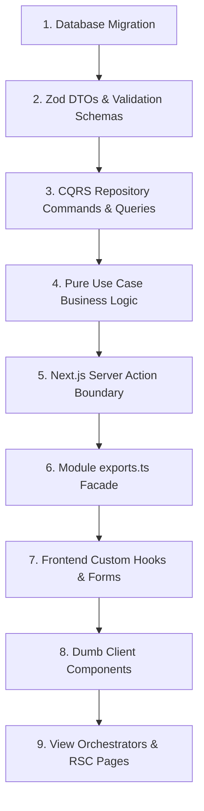

# 🦷 Samson Dental - Serverless Architecture & Developer Navigation Guide

Welcome to the Samson Dental Developer Guide. This document serves as the master navigation index and development flow playbook. It helps you understand the design of the application, locate resources, and follow the exact steps required to implement new features.

---

## 🗺️ Project Architecture Overview

The codebase is structured as a **Modular Monolith (Modulith)** built on **Next.js (App Router)** and **Supabase**. This means business logic is grouped into self-contained domain modules rather than technical layers, isolating domains and keeping dependencies acyclic.

```text
samson-website/
├── .CORE_DOCUMENTATION/         # Deep-dive system documentation (System Design docs)
├── samson-nextjs/               # Next.js Application Root
│   ├── migrations/              # PostgreSQL Database migrations
│   ├── schema.sql               # Full PostgreSQL database schema definition
│   ├── src/
│   │   ├── app/                 # Next.js App Router (Routing, Layouts, RSC entry points)
│   │   ├── shared/              # Shared Kernel (database clients, global errors/utils, shared UI)
│   │   ├── modules/             # Business Domains (isolated cores: appointments, billing, staff, etc.)
│   │   │   └── [domain]/        # Dedicated folder for each domain with standard sub-layers
│   │   └── orchestrators/       # Cross-module workflows (coordinates operations across modules)
```

---

## 🧭 System Design Documentation Index

Detailed architectural principles and guidelines are partitioned into specialized files. Use these links to jump directly to specific topics:

### ⚙️ Backend Architecture & Patterns
* **[0-GUIDELINES.md](file:///c:/Users/picar/Desktop/samson-website/.CORE_DOCUMENTATION/SERVERLESS_ARCHI/0-SYSTEM-DESIGN-V2/backend/0-GUIDELINES.md)**: Main backend index, unified checklists, and skill maps.
* **[1-ARCHITECTURE.md](file:///c:/Users/picar/Desktop/samson-website/.CORE_DOCUMENTATION/SERVERLESS_ARCHI/0-SYSTEM-DESIGN-V2/backend/1-ARCHITECTURE.md)**: Monolith design principles, aggregate subfolder structures, and CQRS functional repository patterns.
* **[1.5-CODING-PATTERNS.md](file:///c:/Users/picar/Desktop/samson-website/.CORE_DOCUMENTATION/SERVERLESS_ARCHI/0-SYSTEM-DESIGN-V2/backend/1.5-CODING-PATTERNS.md)**: DRY code blueprints (Zod transformations, functional repositories, use-cases, server actions).
* **[3-CLEAN_CODE.md](file:///c:/Users/picar/Desktop/samson-website/.CORE_DOCUMENTATION/SERVERLESS_ARCHI/0-SYSTEM-DESIGN-V2/backend/3-CLEAN_CODE.md)**: Layer responsibilities (Controller vs Service vs Repository) and the "Pure Read" bypass shortcut rules.
* **[4-TESTING_GUIDELINES.md](file:///c:/Users/picar/Desktop/samson-website/.CORE_DOCUMENTATION/SERVERLESS_ARCHI/0-SYSTEM-DESIGN-V2/backend/4-TESTING_GUIDELINES.md)**: Unit and Integration testing strategies (Vitest) using co-located test placement.
* **[5-API_VERSIONING.md](file:///c:/Users/picar/Desktop/samson-website/.CORE_DOCUMENTATION/SERVERLESS_ARCHI/0-SYSTEM-DESIGN-V2/backend/5-API_VERSIONING.md)**: Additive routing and the Compatibility Gatekeeper pattern for zero-downtime API changes.
* **[7-DATABASE_SCHEMA.md](file:///c:/Users/picar/Desktop/samson-website/.CORE_DOCUMENTATION/SERVERLESS_ARCHI/0-SYSTEM-DESIGN-V2/backend/7-DATABASE_SCHEMA.md)**: Schema documentation, core tables, triggers, and extension enums.

### 🎨 Frontend UI/UX Architecture
* **[0-GUIDELINES.md](file:///c:/Users/picar/Desktop/samson-website/.CORE_DOCUMENTATION/SERVERLESS_ARCHI/0-SYSTEM-DESIGN-V2/frontend/0-GUIDELINES.md)**: Main frontend index, UI checklists, and visual system guidelines.
* **[1-ARCHITECTURE.md](file:///c:/Users/picar/Desktop/samson-website/.CORE_DOCUMENTATION/SERVERLESS_ARCHI/0-SYSTEM-DESIGN-V2/frontend/1-ARCHITECTURE.md)**: Frontend folders, compound component extraction triggers, `'use client'` boundary rules, and path alias enforcement.
* **[2-REACT-COMPONENTS.md](file:///c:/Users/picar/Desktop/samson-website/.CORE_DOCUMENTATION/SERVERLESS_ARCHI/0-SYSTEM-DESIGN-V2/frontend/2-REACT-COMPONENTS.md)**: Dumb client component guidelines, error rendering, and input primitive standards.
* **[3-REACT-HOOKS.md](file:///c:/Users/picar/Desktop/samson-website/.CORE_DOCUMENTATION/SERVERLESS_ARCHI/0-SYSTEM-DESIGN-V2/frontend/3-REACT-HOOKS.md)**: Hook-binding mechanics with React Hook Form, state encapsulation, and mutation pipelines.
* **[4-CODING-PATTERNS.md](file:///c:/Users/picar/Desktop/samson-website/.CORE_DOCUMENTATION/SERVERLESS_ARCHI/0-SYSTEM-DESIGN-V2/frontend/4-CODING-PATTERNS.md)**: UI casing patterns, form architectures, adapters, and ref-forwarding primitives.
* **[5-TESTING_GUIDELINES.md](file:///c:/Users/picar/Desktop/samson-website/.CORE_DOCUMENTATION/SERVERLESS_ARCHI/0-SYSTEM-DESIGN-V2/frontend/5-TESTING_GUIDELINES.md)**: Testing React Hooks in isolation, presentational test exemption rules, and Playwright E2E.
* **[6-MOCK-FIRST-ARCHITECTURE.md](file:///c:/Users/picar/Desktop/samson-website/.CORE_DOCUMENTATION/SERVERLESS_ARCHI/0-SYSTEM-DESIGN-V2/frontend/6-MOCK-FIRST-ARCHITECTURE.md)**: RSC mock injection, component lifecycle flows, and sandbox setups.

### ⚡ Event-Driven & Development Phases
* **[1-EVENT-DRIVEN-ARCHITECTURE.md](file:///c:/Users/picar/Desktop/samson-website/.CORE_DOCUMENTATION/SERVERLESS_ARCHI/0-SYSTEM-DESIGN-V2/1-EVENT-DRIVEN-ARCHITECTURE.md)**: The transactional outbox pattern, claiming pending events, registry, and serverless background event dispatch.
* **[1-PHASE-1-SHARED-CORE.md](file:///c:/Users/picar/Desktop/samson-website/.CORE_DOCUMENTATION/SERVERLESS_ARCHI/3-MENTAL-MODEL/1-PHASE-1-SHARED-CORE.md)**: Foundations of the global shared kernel.
* **[2-PHASE-2-PATIENTS-DOMAIN.md](file:///c:/Users/picar/Desktop/samson-website/.CORE_DOCUMENTATION/SERVERLESS_ARCHI/3-MENTAL-MODEL/2-PHASE-2-PATIENTS-DOMAIN.md)**: Mental model of data flow and baseline development orders.
* **[3-PHASE-3-STAFF-DOMAIN.md](file:///c:/Users/picar/Desktop/samson-website/.CORE_DOCUMENTATION/SERVERLESS_ARCHI/3-MENTAL-MODEL/3-PHASE-3-STAFF-DOMAIN.md)**: Authentication controls, role permissions, and staff registration workflows.

---

## 🔄 Development Flow: How to Build a Feature from Scratch

When implementing a new feature or adding a new domain module, follow this **bottom-to-top development sequence**. This flow minimizes dependency issues and ensures each layer is fully testable from day one.



### 📋 Detailed Implementation Steps

#### 🗄️ Step 1: Database Migration
1. Write a new `.sql` migration file inside the [migrations](file:///c:/Users/picar/Desktop/samson-website/samson-nextjs/migrations) folder (e.g., `YYYYMMDDHHMMSS_create_feature.sql`).
2. Define tables, indexes, custom types, and column triggers using consistent `snake_case` naming conventions.
3. Update the global [schema.sql](file:///c:/Users/picar/Desktop/samson-website/samson-nextjs/schema.sql) file to align with the new migration.

#### 📐 Step 2: Zod DTOs & Validation Schemas
Define inputs, outputs, and database shapes using **Zod** validation schemas.
1. Create a dedicated folder: `src/modules/[domain]/dtos/` (separated by aggregate subfolders, e.g., `management/`).
2. **One file per operation:** Do not group multiple operations. Create sibling files for creation, updates, and responses:
   * `create-[feature].dto.ts`: Contains the input schema validation rules.
   * `[feature]-response.dto.ts`: Contains the database-to-application converter mapping.
3. **Database Casing Bridge:** Database payloads use `snake_case`. Use Zod's `.transform()` within `*-response.dto.ts` to convert snake_case DB structures to `camelCase` application models:
   ```typescript
   export const featureResponseSchema = databaseRecordSchema.transform((data) => ({
     id: data.id,
     isActive: data.is_active,
     durationMinutes: data.duration_minutes,
   }));
   ```
4. Write co-located Vitest unit tests in `*.dto.spec.ts` files to verify validation logic.
5. Register and export all DTOs through the barrel file `src/modules/[domain]/dtos/index.ts`.

#### 💾 Step 3: CQRS Repositories (Database Access)
Database queries are kept strictly isolated into separate functional closures.
1. In `src/modules/[domain]/repositories/[aggregate]/`, create:
   * `[resource].queries.ts`: Read-only actions (Supabase `.select()`).
   * `[resource].commands.ts`: Mutation actions (Supabase `.insert()`, `.update()`, `.delete()`).
2. Export functional closures that accept the database client as a parameter:
   ```typescript
   export const getFeatureQuery = (supabase: SupabaseClient) => {
     return async (id: string): Promise<FeatureResponseDto> => {
       const { data, error } = await supabase.from('features').select().eq('id', id).single();
       if (error) throw new Error(error.message);
       return featureResponseSchema.parse(data); // Transforms snake_case database output to camelCase DTO automatically
     };
   };
   ```
3. Add Vitest unit tests in `*.spec.ts` sibling files.

#### 🧠 Step 4: Pure Use-Cases (Business Logic)
Business rules are isolated, free from framework-specific components like HTTP and database connections.
1. In `src/modules/[domain]/use-cases/[aggregate]/`, write individual `*.use-case.ts` files.
2. Use Functional Dependency Injection: receive repository operations as function arguments.
   ```typescript
   export const createFeatureUseCase = (
     saveFeature: (data: CreateFeatureDto) => Promise<FeatureResponseDto>
   ) => {
     return async (data: CreateFeatureDto): Promise<FeatureResponseDto> => {
       // Apply clinic business rules here (validation, authorization checks, calculations)
       return await saveFeature(data);
     };
   };
   ```
3. Test logic directly in `*.use-case.spec.ts` by passing mocked query/command stubs.

#### 🔌 Step 5: Server Actions (Next.js Controllers)
Server actions serve as the gateway connecting user interfaces to business workflows.
1. In `src/modules/[domain]/actions/[aggregate]/`, create `[operation].action.ts`.
2. Add the `'use server';` directive at the top of the file.
3. Validate inputs using Zod, initialize database client sessions, inject repositories into use-cases, execute the flow, and return standardized serializable structures using `ActionResponse`:
   ```typescript
   import { z } from 'zod';
   import { ActionResponse } from '@/shared/utils/action-response';
   import { createClient } from '@/shared/database/server';
   import { DomainError } from '@/shared/errors';

   export async function createFeatureAction(
     data: CreateFeatureDto
   ): Promise<ActionResponse<FeatureResponseDto>> {
     try {
       const parsed = createFeatureSchema.parse(data);
       const supabase = await createClient(); // Server-side cookie client
       const dbCommand = createFeatureCommand(supabase);
       const useCase = createFeatureUseCase(dbCommand);
       
       const result = await useCase(parsed);
       return { success: true, data: result };
     } catch (error: any) {
       if (error instanceof z.ZodError) {
         return {
           success: false,
           error: 'Validation failed: ' + error.issues[0].message,
         };
       }
       if (error instanceof DomainError) {
         return { success: false, error: error.message };
       }
       return { success: false, error: error.message || "Failed to process" };
     }
   }
   ```
4. Write unit tests in `*.action.spec.ts` to test request validation, auth, and error capture.

#### 🚪 Step 6: Module Facade (exports.ts)
Avoid dependency bloat and client/server boundary issues in Next.js.
1. Define a facade file `src/modules/[domain]/exports.ts`.
2. Export public DTO definitions, views, types, and events.
3. > ⚠️ **CRITICAL BARREL FILE RULE:** Never export Server Actions (`actions/*`) inside `exports.ts`. Doing so will cause Next.js compilation boundaries to bleed. Import server actions directly from their relative paths in UI files.

#### 🎣 Step 7: Frontend Hooks & Form Binding
Extract complex React state, lifecycle rules, and forms to hooks.
1. In `src/modules/[domain]/hooks/[feature]/`, create `use-[feature].ts` and `use-[feature].spec.ts`.
2. Use Zod schemas and `react-hook-form` to wire inputs, validate on the client-side, execute the server action, and return validation messages using the `handleActionError` utility:
   ```typescript
   import { useState } from "react";
   import { useForm } from "react-hook-form";
   import { zodResolver } from "@hookform/resolvers/zod";
   import { ActionResponse, handleActionError } from "@/shared/utils/action-response";

   export const useFeatureForm = () => {
     const [serverError, setServerError] = useState<string | null>(null);
     const form = useForm<CreateFeatureDto>({
       resolver: zodResolver(createFeatureSchema),
     });
     
     const onSubmit = form.handleSubmit(async (values) => {
       setServerError(null);
       try {
         const response = await createFeatureAction(values);
         
         if (!response.success) {
           // Maps server field-level validation errors to form fields,
           // and returns the global error string (if any) to display in the UI.
           const globalError = handleActionError(response, form.setError);
           setServerError(globalError);
           return;
         }
         
         // Handle successful form submission here
       } catch (err: any) {
         setServerError(err.message || "An unexpected error occurred");
       }
     });
     
     return { form, onSubmit, serverError };
   };
   ```

#### 🖥️ Step 8: Dumb Client Components
UI layout elements are kept clean and visual.
1. In `src/modules/[domain]/components/`, write presentational `.tsx` layout files.
2. Dumb components only render JSX styled with pure Tailwind/CSS. They receive all states, form contexts, lists, and event handlers as serializable props.
3. Ensure shared input fields inside [components/ui/](file:///c:/Users/picar/Desktop/samson-website/samson-nextjs/src/components/ui) use `React.forwardRef` to bind to `react-hook-form` properly.

#### 🖼️ Step 9: View Orchestrators & RSC Pages
Glue the server and client components together using View Orchestrators.
1. In `src/modules/[domain]/views/`, create `[view-name]-view.tsx` with a `'use client'` directive.
2. The view orchestrator calls the custom hook, binds states to Dumb Client Components, and manages structural visibility (e.g., loading lists, dialog overlays).
3. In `src/app/(portals)/.../page.tsx`, create the RSC Page. RSC Pages fetch data directly using repository query closures, format it, and feed it into the view orchestrator:
   ```typescript
   // src/app/(portals)/admin/feature/page.tsx
   export default async function FeaturePage() {
     const supabase = await createClient();
     const features = await getFeaturesQuery(supabase)(); // Direct Server-side fetching
     
     return <FeatureView initialFeatures={features} />;
   }
   ```

---

## 🔍 Codebase Navigation Cheat Sheet

Use this table to quickly find code relating to specific capabilities:

| Feature/Folder | Path Link | Key Responsibility |
|:---|:---|:---|
| **App Routing** | [src/app/](file:///c:/Users/picar/Desktop/samson-website/samson-nextjs/src/app) | Routing entry points, portal segregations (`admin`, `booking`, `doctor`, `secretary`). |
| **Shared Primitives** | [src/components/ui/](file:///c:/Users/picar/Desktop/samson-website/samson-nextjs/src/components/ui) | Shared design primitives (forwardRef inputs, buttons, dialog overlays). |
| **Outbox Bus** | [src/shared/outbox/](file:///c:/Users/picar/Desktop/samson-website/samson-nextjs/src/shared/outbox) | Transactional Outbox registry, command executors, and event dispatchers. |
| **Subscribers** | [src/orchestrators/event-subscribers.ts](file:///c:/Users/picar/Desktop/samson-website/samson-nextjs/src/orchestrators/event-subscribers.ts) | Bootstrapping the event dispatcher, subscribing modules to domain events. |
| **Database Server** | [src/shared/database/server.ts](file:///c:/Users/picar/Desktop/samson-website/samson-nextjs/src/shared/database/server.ts) | Server client instances, admin clients, and cookie handlers. |
| **Shared Auth** | [src/shared/auth/](file:///c:/Users/picar/Desktop/samson-website/samson-nextjs/src/shared/auth) | Central authorization rules (`authorizeRole`) and session checks. |

---

## 🛠️ Graphify Knowledge Graph Rules

This repository maintains a structural knowledge graph located in `graphify-out/`. To queries relative relationships and analyze dependencies, follow these rules:

1. **Query Codebase Questions:** If you have questions about file relationships or code flows, run the following CLI command or use the `query_graph` tool:
   ```bash
   graphify query "How do appointments interact with patient dependents?"
   ```
2. **Shortest Paths:** Find relationships between two files/modules:
   ```bash
   graphify path "src/modules/appointments" "src/modules/patients"
   ```
3. **Graph updates:** After modifying code files in this session, run `graphify update .` to keep the AST structural graph fresh:
   ```bash
   graphify update .
   ```

---

*Document Version: 1.0 (Developer Navigation Manual) - Last Updated: 2026-06-03*
